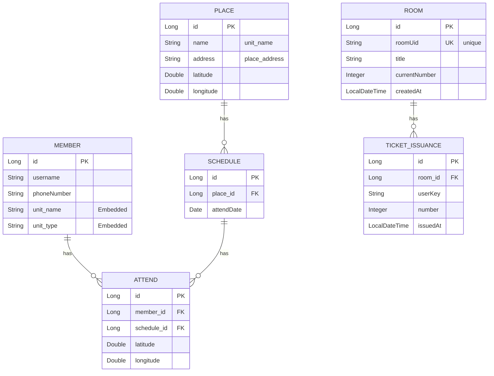
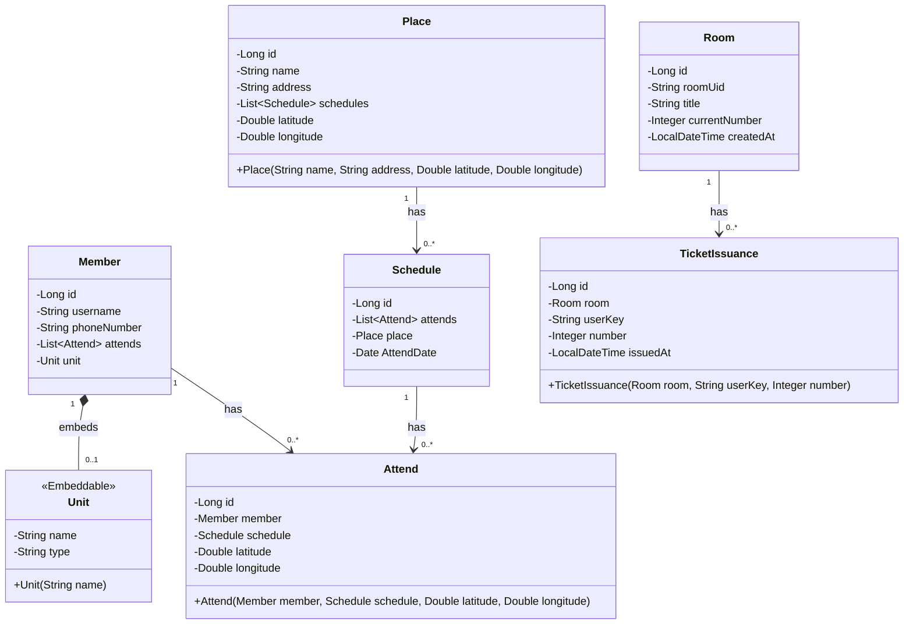
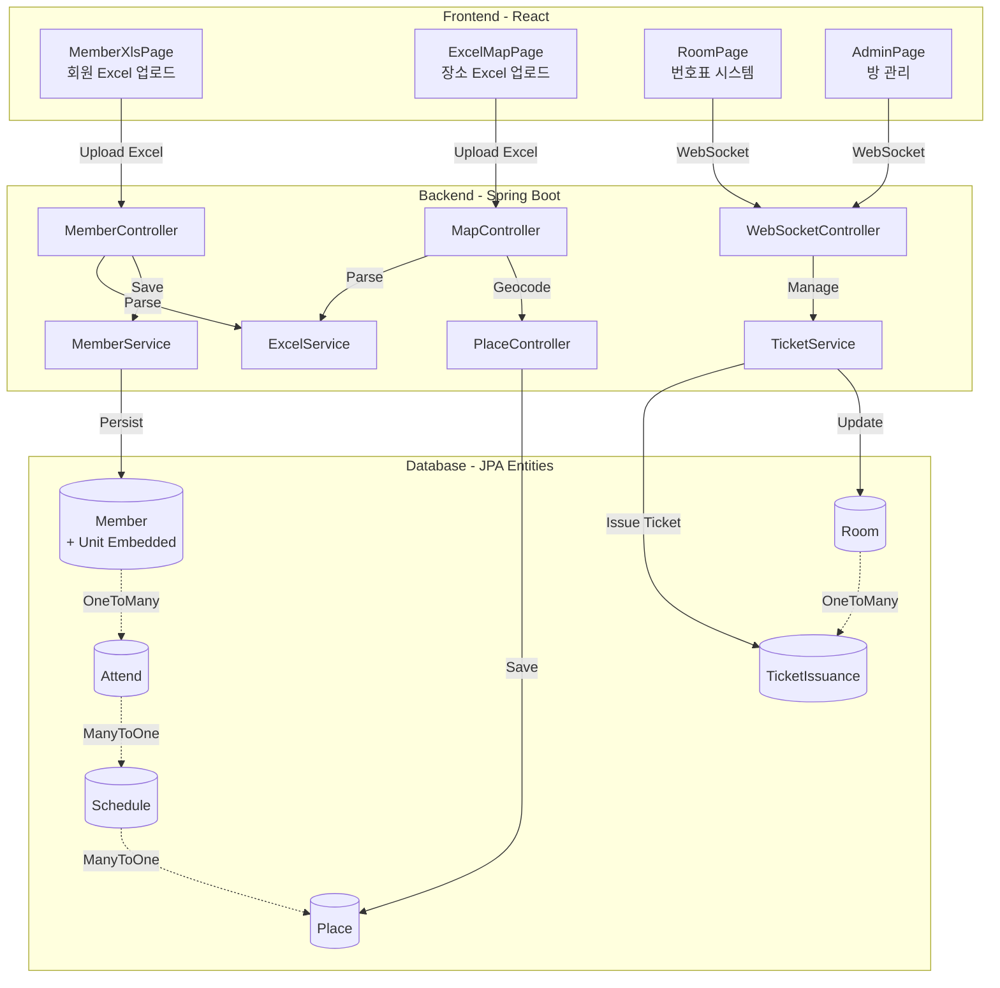
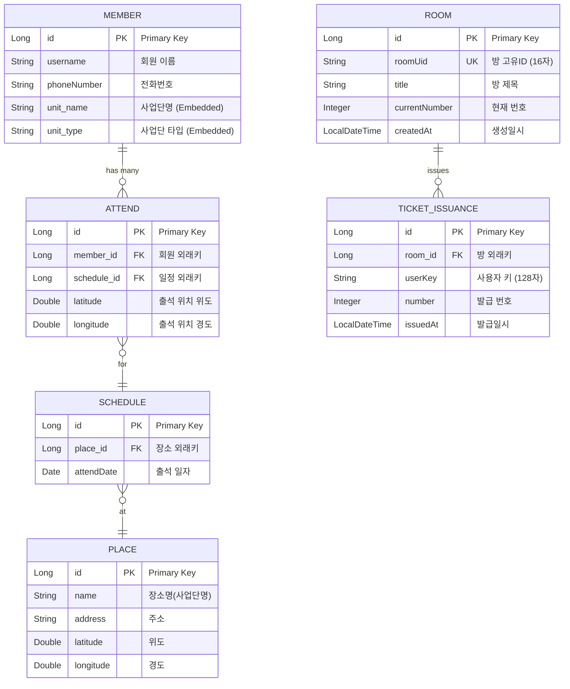
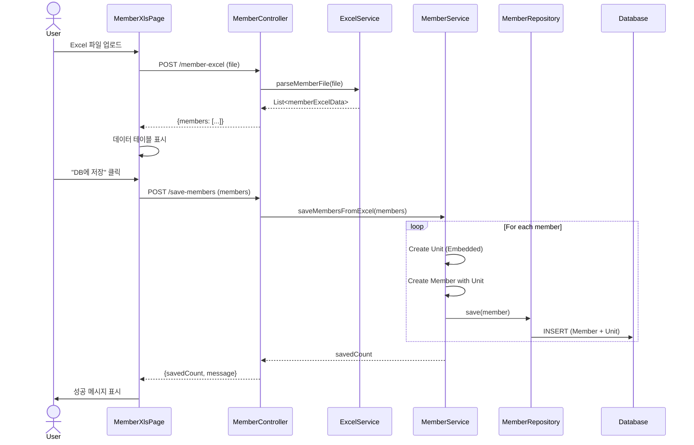
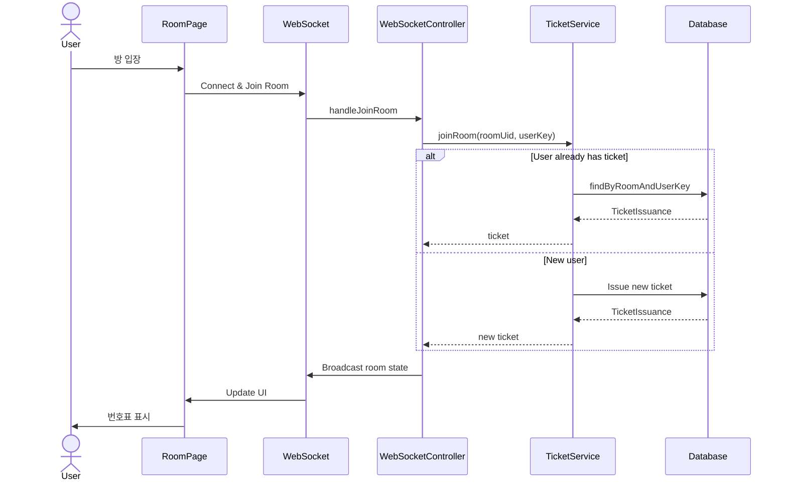

# Database Diagrams

## ER Diagram (Entity Relationship Diagram)

## ORM Class Diagram (객체 관계 다이어그램)

## Detailed Relationships

### 출석 관리 시스템
- **Member ↔ Unit**: Member는 Unit(사업단) 정보를 임베디드 타입으로 포함 (Embedded)
  - Unit은 독립적인 엔티티가 아닌 값 타입
  - Member 테이블에 unit_name, unit_type 컬럼으로 저장
- **Member ↔ Attend**: Member는 여러 출석 기록을 가질 수 있음 (OneToMany)
- **Schedule ↔ Attend**: Schedule은 여러 출석 기록을 가질 수 있음 (OneToMany)
- **Place ↔ Schedule**: Place는 여러 일정을 가질 수 있음 (OneToMany)

### 번호표 시스템
- **Room ↔ TicketIssuance**: Room은 여러 번호표 발급 기록을 가질 수 있음 (OneToMany)
- TicketIssuance는 room_id와 user_key, room_id와 number에 unique constraint가 있음

## Database Constraints

### TICKET_ISSUANCE
- **ux_room_user**: UNIQUE(room_id, user_key) - 한 방에서 한 사용자는 하나의 번호표만 발급
- **ux_room_number**: UNIQUE(room_id, number) - 한 방에서 같은 번호는 중복 불가
- **fk_ti_room**: FOREIGN KEY(room_id) REFERENCES rooms(id)

### ROOM
- **room_uid**: UNIQUE, 길이 16자, NOT NULL - 방 고유 식별자

## System Architecture Diagram

## Detailed Entity Relationships with Cardinality

## Business Logic Flow

### 회원 Excel 업로드 및 저장 플로우

### 번호표 발급 플로우

