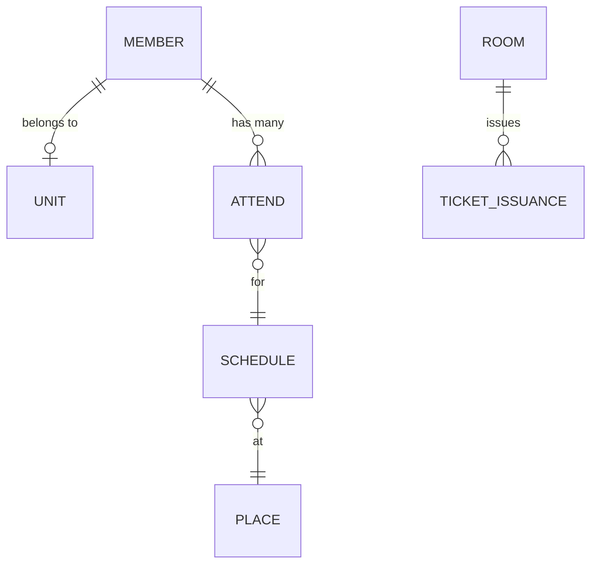

# Attendance Management & Ticket System

출석 관리, 장소 기반 서비스, 실시간 번호표 시스템을 제공하는 풀스택 웹 애플리케이션입니다.

## 📋 목차

- [사용자 가이드](#사용자-가이드)
- [주요 기능](#주요-기능)
- [기술 스택](#기술-스택)
- [시작하기](#시작하기)
- [프로젝트 구조](#프로젝트-구조)
- [API 엔드포인트](#api-엔드포인트)
- [데이터베이스 구조](#데이터베이스-구조)
- [개발 가이드](#개발-가이드)

## 📖 사용자 가이드

### 관리자 및 담당자를 위한 가이드

이 시스템은 노인 일자리 사업 참여자를 관리하는 담당자를 위한 도구입니다.

- **🚀 [빠른 시작 가이드](src/main/resources/markDown/QUICK_START.md)** - 5분 만에 시작하기
  - 처음 사용하시는 분들을 위한 간단한 시작 가이드
  - 단계별 스크린샷과 함께 제공
  - 가장 많이 사용하는 기능 위주로 설명

- **📚 [상세 사용자 가이드](./USER_GUIDE.md)** - 전체 기능 안내
  - 모든 기능에 대한 상세한 설명
  - FAQ (자주 묻는 질문)
  - 문제 해결 방법
  - 용어 설명

### 개발자를 위한 문서

- **🗄️ [데이터베이스 다이어그램](src/main/resources/markDown/DATABASE_DIAGRAMS.md)** - ER 다이어그램 및 시스템 구조
- **🏢 [Room API 가이드](ROOM_API_GUIDE.md)** - 번호표 방 관리 API 상세 문서
- **🔧 [문제 해결 가이드](TROUBLESHOOTING.md)** - 주요 이슈 및 해결 방법
- **📄 [비즈니스 로직 문서](BUSINESS_LOGIC_FOR_PAPER.md)** - 논문용 핵심 비즈니스 로직 정리

### Flutter 앱 개발자를 위한 문서

- **📱 [Flutter 빠른 시작](FLUTTER_QUICKSTART.md)** - 5분 만에 Flutter 앱 연동하기
- **📱 [Flutter 통합 가이드](FLUTTER_INTEGRATION_GUIDE.md)** - Flutter 앱 전체 연동 가이드
- **🧪 [API 테스트 가이드](API_TESTING_GUIDE.md)** - REST API 및 WebSocket 테스트 방법

## ✨ 주요 기능

### 1. 회원 관리 시스템
- **Excel 업로드**: 회원 정보(이름, 전화번호, 사업단)를 Excel 파일로 일괄 업로드
- **자동 Unit 생성**: 사업단이 없으면 자동으로 생성하여 연결
- **회원 CRUD**: RESTful API를 통한 회원 정보 관리
- **데이터 검증**: 파일 형식 및 데이터 유효성 검증

### 2. 장소 관리 시스템
- **Excel 기반 장소 등록**: 주소가 포함된 Excel 파일 업로드
- **자동 Geocoding**: Google Maps API를 통한 주소 → 좌표 자동 변환
- **지도 시각화**: Google Maps로 여러 장소를 마커로 표시
- **일괄 저장**: 변환된 장소 정보를 데이터베이스에 일괄 저장

### 3. 실시간 번호표 시스템
- **WebSocket 통신**: 실시간 양방향 통신으로 즉각적인 상태 업데이트
- **방 관리**: 여러 대기실(Room) 생성 및 관리
  - RESTful API를 통한 방 CRUD 기능
  - 일괄 생성으로 여러 방 한 번에 등록
  - 활성화/비활성화 상태 관리
  - 번호 초기화 기능
- **자동 번호 발급**: 사용자별 고유 번호표 자동 발급
- **중복 방지**: 한 방에서 한 사용자당 하나의 번호표만 발급
- **현재 번호 관리**: 관리자가 현재 호출 번호 업데이트
- **실시간 동기화**: 모든 참여자에게 실시간으로 상태 전파

### 4. 출석 관리
- **위치 기반 출석**: GPS 좌표를 활용한 출석 체크
- **스케줄 관리**: 장소별 출석 일정 관리
- **출석 기록**: 회원별 출석 이력 추적
- **출석 상태 추적**: SCHEDULED, PRESENT, ABSENT, LATE, EXCUSED 상태 관리

## 🛠 기술 스택

### Backend
- **Framework**: Spring Boot 3.5.6
- **Language**: Java 17
- **Database**: MariaDB (개발/테스트 시 H2 사용 가능)
- **ORM**: JPA / Hibernate 6
- **Real-time**: WebSocket (STOMP)
- **Cache**: Redis
- **Build Tool**: Gradle
- **API Documentation**: SpringDoc OpenAPI 3.0
- **Libraries**:
  - Apache POI (Excel 처리)
  - Jsoup (웹 스크래핑)
  - Lombok (코드 간소화)
  - p6spy (SQL 로깅)
  - Google Maps Services (Geocoding)

### Frontend
- **Framework**: React 19.1.1
- **Build Tool**: Vite 7.1.7
- **Routing**: React Router v7
- **State Management**: Zustand 5.0
- **Styling**: CSS Modules
- **HTTP Client**: Axios
- **Real-time**: STOMP over WebSocket
- **Maps**: @react-google-maps/api

### External APIs
- Google Maps Geocoding API
- Google Maps JavaScript API

## 🚀 시작하기

### 사전 요구사항

- Java 17 이상
- Node.js 18 이상
- npm 또는 yarn
- MariaDB 10.6 이상 (또는 개발/테스트 시 H2 사용 가능)
- Redis (선택사항)
- Google Cloud Platform 계정 (Maps API 키 필요)

### 설정

#### 1. 저장소 클론

```bash
git clone https://github.com/TetraLabYonam/api.git
cd attempt
```

#### 2. 데이터베이스 설정

##### MariaDB 설치 및 설정 (권장)

**macOS (Homebrew):**
```bash
brew install mariadb
brew services start mariadb
```

**Ubuntu/Debian:**
```bash
sudo apt update
sudo apt install mariadb-server
sudo systemctl start mariadb
```

**Windows:**
- [MariaDB 공식 사이트](https://mariadb.org/download/)에서 설치 파일 다운로드

##### 데이터베이스 및 사용자 생성

```bash
# MariaDB 접속
mysql -u root -p

# 데이터베이스 생성
CREATE DATABASE queueapp CHARACTER SET utf8mb4 COLLATE utf8mb4_unicode_ci;

# 사용자 생성 및 권한 부여
CREATE USER 'queue'@'localhost' IDENTIFIED BY 'queuepw';
GRANT ALL PRIVILEGES ON queueapp.* TO 'queue'@'localhost';
FLUSH PRIVILEGES;
EXIT;
```

> **개발/테스트 환경**: MariaDB 대신 H2 In-Memory DB를 사용하려면 `application.yml`에서 datasource 설정을 H2로 변경하세요.

#### 3. Google API 키 설정

##### Google Cloud Console에서 API 키 발급

1. [Google Cloud Console](https://console.cloud.google.com/) 접속
2. 프로젝트 생성 또는 기존 프로젝트 선택
3. 좌측 메뉴에서 "API 및 서비스" > "사용자 인증 정보" 클릭
4. "사용자 인증 정보 만들기" > "API 키" 선택
5. 다음 API들을 활성화:
   - [Geocoding API](https://console.cloud.google.com/apis/library/geocoding-backend.googleapis.com)
   - [Maps JavaScript API](https://console.cloud.google.com/apis/library/maps-backend.googleapis.com)
6. 발급받은 API 키 복사

##### 백엔드 설정 파일 생성

```bash
cd src/main/resources
cp application-API-KEY.properties.example application-API-KEY.properties
```

`application-API-KEY.properties` 파일을 열고 API 키 입력:

```properties
geocoding-api-key=YOUR_GOOGLE_GEOCODING_API_KEY_HERE
```

##### 프론트엔드 환경 변수 설정

```bash
cd frontend
cp .env.example .env.development
```

`.env.development` 파일을 열고 설정:

```env
VITE_API_URL=http://localhost:8080
VITE_GOOGLE_MAPS_API_KEY=YOUR_GOOGLE_MAPS_API_KEY_HERE
```

> **보안**: `.env.*` 파일과 `application-API-KEY.properties`는 `.gitignore`에 포함되어 Git에 커밋되지 않습니다.

### 실행

#### 백엔드 실행

```bash
# 프로젝트 루트 디렉토리에서
./gradlew bootRun
```

또는 IDE에서:
1. IntelliJ IDEA에서 프로젝트 열기
2. `AttemptApplication.java` 파일의 `main` 메서드 실행

#### 프론트엔드 실행

```bash
cd frontend
npm install
npm run dev
```

### 접속

- **프론트엔드**: `http://localhost:5173`
- **백엔드 API**: `http://localhost:8080`
- **API 문서 (Swagger UI)**: `http://localhost:8080/swagger-ui/index.html`
- **OpenAPI JSON**: `http://localhost:8080/v3/api-docs`

#### 데이터베이스 접속 정보

**MariaDB:**
- Host: `localhost`
- Port: `3306`
- Database: `queueapp`
- Username: `queue`
- Password: `queuepw`

**H2 Console** (개발 모드):
- URL: `http://localhost:8080/h2-console`
- JDBC URL: `jdbc:h2:mem:test`
- Username: `sa`
- Password: (비어있음)

## 📁 프로젝트 구조

```
attempt/
├── src/main/java/com/example/attempt/
│   ├── config/                    # 설정 파일
│   │   └── WebSocketConfig.java  # WebSocket 설정
│   ├── controller/                # REST & WebSocket 컨트롤러
│   │   ├── MemberController.java
│   │   ├── MapController.java
│   │   ├── PlaceController.java
│   │   ├── RoomController.java
│   │   ├── ScheduleController.java
│   │   ├── AttendController.java
│   │   └── websocket/
│   │       └── WebSocketController.java
│   ├── domain/                    # JPA 엔티티
│   │   ├── Member.java
│   │   ├── Unit.java
│   │   ├── Attend.java
│   │   ├── Schedule.java
│   │   ├── Place.java
│   │   ├── Room.java
│   │   └── TicketIssuance.java
│   ├── repository/                # 데이터 접근 계층
│   │   ├── MemberRepository.java
│   │   ├── UnitRepository.java
│   │   ├── PlaceRepository.java
│   │   ├── RoomRepository.java
│   │   └── TicketIssuanceRepository.java
│   └── service/                   # 비즈니스 로직
│       ├── MemberService.java
│       ├── ExcelService.java
│       ├── TicketService.java
│       ├── RoomService.java
│       ├── ScheduleService.java
│       ├── AttendService.java
│       └── PlaceService.java
│
├── frontend/
│   ├── src/
│   │   ├── components/            # React 컴포넌트
│   │   │   ├── Layout/
│   │   │   └── common/
│   │   ├── pages/                 # 페이지 컴포넌트
│   │   │   ├── HomePage.jsx
│   │   │   ├── MemberXlsPage.jsx  # 회원 Excel 업로드
│   │   │   ├── ExcelMapPage.jsx   # 장소 Excel 업로드 & 지도
│   │   │   ├── RoomPage.jsx       # 번호표 시스템
│   │   │   └── AdminPage.jsx      # 방 관리 (관리자)
│   │   ├── services/              # API 서비스
│   │   │   ├── api.js
│   │   │   ├── socketService.js
│   │   │   └── roomService.js
│   │   ├── contexts/              # React Context
│   │   │   └── SocketContext.jsx
│   │   ├── stores/                # Zustand 상태 관리
│   │   │   ├── roomStore.js
│   │   │   └── userStore.js
│   │   └── App.jsx                # 루트 컴포넌트
│   ├── package.json
│   └── vite.config.js             # Vite 설정
│
└── DATABASE_DIAGRAMS.md           # 데이터베이스 다이어그램 문서
```

## 🔌 API 엔드포인트

> **💡 Tip**: 전체 API 문서는 서버 실행 후 [Swagger UI](http://localhost:8080/swagger-ui.html)에서 확인하세요.

### Member API (`/api/v1/member`)

| Method | Endpoint | Description |
|--------|----------|-------------|
| POST | `/` | 회원 생성 |
| GET | `/` | 전체 회원 조회 |
| GET | `/{id}` | 특정 회원 조회 |
| PUT | `/{id}` | 회원 정보 수정 |
| DELETE | `/{id}` | 회원 삭제 |
| POST | `/member-excel` | Excel 파일 업로드 및 파싱 |
| POST | `/save-members` | 파싱된 회원 데이터 DB 저장 |

### Place API (`/api/place`)

| Method | Endpoint | Description |
|--------|----------|-------------|
| GET | `/` | 외부 사이트 장소 스크래핑 |
| POST | `/save` | 단일 장소 저장 |
| POST | `/save-all` | 다수 장소 일괄 저장 |

### Map API

| Method | Endpoint | Description |
|--------|----------|-------------|
| GET | `/mapV1` | 지도 뷰 (단일 위치) |
| GET | `/map-excel` | Excel 업로드 페이지 |
| POST | `/api/map-excel` | Excel 파일에서 주소 추출 및 좌표 변환 |

### Room API (`/api/v1/rooms`)

> 📘 상세한 API 사용법은 [ROOM_API_GUIDE.md](ROOM_API_GUIDE.md)를 참고하세요.

| Method | Endpoint | Description |
|--------|----------|-------------|
| GET | `/` | 활성화된 방 목록 조회 |
| GET | `/all` | 전체 방 목록 조회 (비활성화 포함) |
| GET | `/{id}` | 방 상세 조회 (ID) |
| GET | `/uid/{roomUid}` | 방 상세 조회 (UID) |
| GET | `/details` | 방 상세 정보 조회 (TicketService 기반) |
| GET | `/{uid}/state` | 방 상태 조회 |
| GET | `/{uid}/issuances` | 방 발급 내역 조회 |
| POST | `/` | 방 생성 |
| POST | `/batch` | 방 일괄 생성 |
| POST | `/{uid}/reset` | 방 번호 초기화 |
| PUT | `/{id}` | 방 정보 수정 |
| PUT | `/{id}/activate` | 방 활성화 |
| PUT | `/{id}/deactivate` | 방 비활성화 |
| DELETE | `/{id}` | 방 삭제 |

**방 일괄 생성 예제:**
```bash
curl -X POST http://localhost:8080/api/v1/rooms/batch \
  -H "Content-Type: application/json" \
  -d '{
    "roomNames": [
      "물금청소년문화의집",
      "동면 행정복지센터",
      "원동면 행정복지센터",
      "상북면 행정복지센터",
      "하북면 행정복지센터",
      "양산시니어클럽"
    ]
  }'
```

### Schedule API (`/api/v1/schedule`)

| Method | Endpoint | Description |
|--------|----------|-------------|
| GET | `/` | 전체 일정 조회 |
| GET | `/{id}` | 특정 일정 조회 |
| GET | `/date/{date}` | 특정 날짜의 일정 조회 |
| GET | `/active` | 활성화된 일정 조회 |
| POST | `/` | 일정 생성 |
| PUT | `/{id}` | 일정 수정 |
| PUT | `/{id}/deactivate` | 일정 비활성화 |
| DELETE | `/{id}` | 일정 삭제 |

### Attend API (`/api/v1/attend`)

| Method | Endpoint | Description |
|--------|----------|-------------|
| GET | `/schedule/{scheduleId}` | 특정 일정의 출석 목록 조회 |
| GET | `/member/{memberId}` | 특정 회원의 출석 기록 조회 |
| POST | `/` | 출석 등록 |
| PUT | `/{id}/mark-present` | 출석 처리 |
| PUT | `/{id}/mark-absent` | 결석 처리 |
| PUT | `/{id}/mark-late` | 지각 처리 |

### WebSocket Endpoints

| Destination | Description |
|------------|-------------|
| `/ws` | WebSocket 연결 엔드포인트 (SockJS) |
| `/ws/queue` | WebSocket 연결 엔드포인트 (큐 전용, 하위 호환) |
| `/app/room/join` | 방 입장 |
| `/app/room/issue` | 번호표 발급 |
| `/app/room/notify` | 특정 번호 알림 (관리자) |
| `/topic/room/{roomUid}/state` | 방 상태 구독 |
| `` | 개인 알림 구독 |

## 🗄️ 데이터베이스 구조

상세한 ER 다이어그램과 ORM 클래스 다이어그램은 [DATABASE_DIAGRAMS.md](src/main/resources/markDown/DATABASE_DIAGRAMS.md)를 참고하세요.

### 주요 엔티티

#### 회원 관리
- **Member**: 회원 정보 (이름, 전화번호)
- **Unit**: 사업단 정보

#### 출석 관리
- **Attend**: 출석 기록 (위치 정보 포함)
- **Schedule**: 일정 정보
- **Place**: 장소 정보 (주소, 좌표)

#### 번호표 시스템
- **Room**: 대기실 정보
- **TicketIssuance**: 번호표 발급 기록

### 주요 관계



## 💻 개발 가이드

### 백엔드 테스트

```bash
./gradlew test
```

### 백엔드 빌드

```bash
./gradlew build
```

### 프론트엔드 빌드

```bash
cd frontend
npm run build
```

### 코드 스타일

- **Backend**: Java 코드 컨벤션 준수
- **Frontend**: ESLint 설정 사용

### Git 커밋 메시지 컨벤션

```
FEAT: 새로운 기능 추가
FIX: 버그 수정
REFACT: 코드 리팩토링
DOCS: 문서 수정
TEST: 테스트 코드 추가/수정
SECURITY: 보안 관련 수정
```

## 🔒 보안 주의사항

- **API 키 관리**:
  - 절대로 API 키를 Git에 커밋하지 마세요
  - `.env` 파일과 `application-API-KEY.properties`는 `.gitignore`에 포함됨
  - 프로덕션 환경에서는 환경 변수 또는 Secret Manager 사용 권장

- **데이터베이스 보안**:
  - 기본 비밀번호(`queuepw`) 변경 필수
  - 프로덕션 환경에서는 강력한 비밀번호 사용
  - 필요한 권한만 부여 (최소 권한 원칙)

- **프로덕션 배포 체크리스트**:
  - [ ] H2 콘솔 비활성화 (`spring.h2.console.enabled=false`)
  - [ ] `ddl-auto`를 `validate` 또는 `none`으로 변경
  - [ ] MariaDB 비밀번호 변경 및 환경 변수로 관리
  - [ ] CORS 설정 검토 (허용된 origin만 지정)
  - [ ] WebSocket CORS 설정 검토 (`app.socket.cors-origins`)
  - [ ] Redis 비밀번호 설정 (사용 시)
  - [ ] HTTPS 적용
  - [ ] 민감한 정보를 환경 변수로 관리

## 📝 주요 변경 이력

- **2025-11-28**: Room API 추가 및 문서화
  - Room CRUD API 구현 (`/api/v1/rooms`)
  - 일괄 방 생성 기능 추가
  - RoomService, RoomController, Room DTOs 추가
  - ROOM_API_GUIDE.md 작성
  - TROUBLESHOOTING.md 작성 (의존성 주입, Flyway, Swagger, WebSocket 문제 해결 기록)
- **2025-11-28**: 출석 및 스케줄 관리 기능 개선
  - Schedule API 구현 (`/api/v1/schedule`)
  - Attend API 구현 (`/api/v1/attend`)
  - 출석 상태 관리 (SCHEDULED, PRESENT, ABSENT, LATE, EXCUSED)
  - Flyway 마이그레이션 추가 (V1__init_schema.sql)
- **2025-11-28**: 문제 해결 및 최적화
  - DataInitializer 의존성 주입 문제 해결
  - Flyway 마이그레이션 설정 개선 (local vs production)
  - Swagger 버전 호환성 문제 해결 (SpringDoc 2.7.0 업그레이드)
  - WebSocket 엔드포인트 개선 (`/ws`, `/ws/queue` 추가)
- **2025-11-24**: 데이터베이스 H2 → MariaDB 전환, React 19 업그레이드
- **2025-11**: React 프론트엔드 마이그레이션 (Vite 기반)
- **2025-11**: Zustand 상태 관리 라이브러리 도입
- **2025-11**: Socket.io → WebSocket(STOMP) 마이그레이션
- **2025-11**: 실시간 번호표 시스템 구현
- **2025-11**: Excel 기반 장소 관리 및 Geocoding 기능 구현
- **2025-11**: Google Maps API 통합
- **2025-11**: SpringDoc OpenAPI 문서화 추가

## 📄 라이선스

이 프로젝트는 개인 학습/개발 목적으로 작성되었습니다.

## 📧 문의

프로젝트 관련 문의사항은 [GitHub Issues](https://github.com/TetraLabYonam/api/issues)를 통해 등록해주세요.

---

🤖 Generated with [Claude Code](https://claude.com/claude-code)