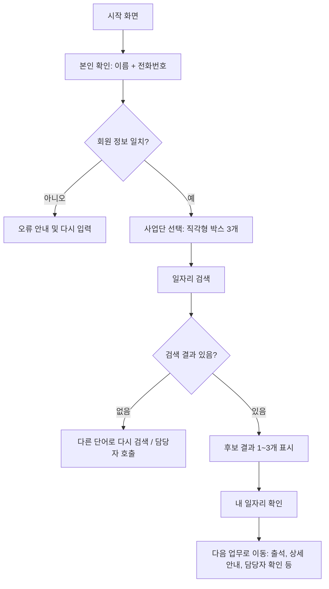
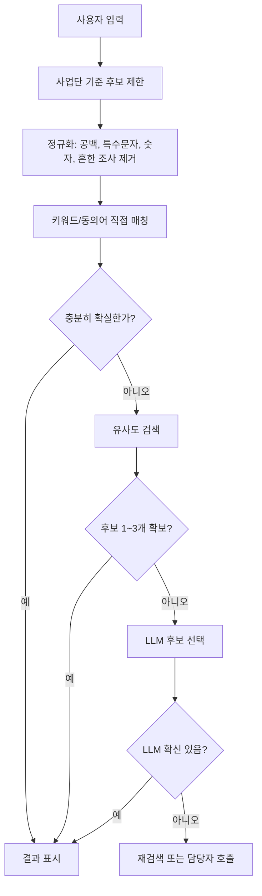

# 시니어 일자리 검색 키오스크 화면 흐름 기획

## 1. 목적

시니어 일자리 참여자가 본인의 정확한 일자리 풀네임을 몰라도 이름과 전화번호로 본인 확인을 한 뒤, 소속 사업단을 고르고, 쉬운 생활 단어로 본인의 일자리를 찾을 수 있는 단순 화면 흐름을 만든다.

참고 UI는 은행 ATM처럼 큰 직각형 버튼, 강한 색 대비, 짧은 질문 문장, 단계별 선택 화면을 사용한다. 사용자는 복잡한 메뉴를 읽는 대신 `본인 확인 -> 사업단 선택 -> 일자리 검색 -> 결과 확인` 순서로만 이동한다.

## 2. 핵심 사용자

- 시니어 일자리 참여자
- 스마트폰 또는 키오스크 화면 조작에 익숙하지 않은 사용자
- 본인 일자리의 행정상 정확한 명칭을 모르는 사용자
- 담당자가 엑셀 또는 관리자 화면으로 사업단, 일자리, 검색 키워드를 관리하는 운영 환경

## 3. 전체 화면 흐름

## 4. 화면별 기획

### 4.1 시작 및 본인 확인

목표는 로그인이라기보다 빠른 본인 확인이다.

입력 항목:

- 이름
- 전화번호 뒤 4자리 또는 전체 전화번호

권장 동작:

- 이름 입력 칸과 전화번호 입력 칸을 크게 배치한다.
- 숫자 입력은 화면 키패드를 제공한다.
- 입력 완료 버튼은 초록색, 취소 또는 처음으로 버튼은 주황색으로 분리한다.
- 회원 정보가 없으면 "정보를 찾지 못했습니다. 다시 입력하거나 담당자에게 문의해주세요."처럼 짧게 안내한다.

### 4.2 사업단 선택

본인 확인이 끝나면 세 가지 사업단을 큰 직각형 박스 3개로 보여준다.

표시 방식:

- 한 화면에 사업단 박스 3개를 같은 크기로 배치한다.
- 각 박스에는 사업단명만 크게 표시한다.
- 사업단명은 운영 데이터에서 가져오며, 고정 문구로 박아두지 않는다.
- 사용자가 사업단을 고르면 해당 사업단 안의 일자리 후보만 검색 대상으로 제한한다.

예시:

- 사업단 A
- 사업단 B
- 사업단 C

실제 명칭은 관리자 데이터 기준으로 대체한다.

### 4.3 일자리 검색

사용자가 본인 일자리의 정식 명칭을 모르는 상황을 기본값으로 둔다. 검색창에는 "어떤 일을 하시나요?"처럼 자연어 질문을 표시한다.

입력 예시:

- 분리수거
- 깃발
- 청소
- 텃밭
- 우유팩
- 공원 청소
- 학교 앞 깃발
- 종이팩 모으는 일

화면 구성:

- 왼쪽 또는 상단에 큰 질문 문장
- 중앙에 검색 입력창
- 하단에 자주 쓰는 단어 빠른 선택 버튼
- 결과가 나오면 후보 1~3개를 큰 박스로 표시
- 각 후보는 `일자리명`, `장소/기관명`, `간단 설명`만 보여준다.

### 4.4 결과 확인

검색 결과를 바로 확정하지 않고, 마지막에 "이 일자리가 맞나요?" 확인 화면을 둔다.

버튼:

- `예` 초록색
- `아니오` 주황색

`아니오`를 누르면 이전 검색 화면으로 돌아가며, 담당자 호출 또는 다른 단어 검색을 제공한다.

## 5. 도메인 전용 단어 학습 방향

이 기능의 핵심은 범용 검색이 아니라 사업단 내부 일자리 표현을 이해하는 것이다. 참여자가 말하는 생활 단어와 행정상 일자리명을 연결해야 한다.

### 5.1 1차 MVP: 경량 키워드 사전 + LLM 후보 선택

처음부터 별도 모델을 학습하기보다, 다음 구조가 현실적이다.

1. 전체 사업단의 일자리 데이터를 수집한다.
2. 각 일자리마다 담당자가 대표 키워드와 동의어를 등록한다.
3. 검색 시 선택한 사업단으로 후보군을 먼저 줄인다.
4. 키워드 완전 일치, 부분 일치, 초성/오타 유사도 검색을 먼저 수행한다.
5. 결과가 애매할 때만 LLM에게 후보 목록 중 가장 가까운 일자리 하나를 고르게 한다.

이 방식은 벡터 DB나 별도 학습 인프라 없이도 "분리수거", "우유팩", "깃발" 같은 현장 단어를 처리할 수 있다.

### 5.2 학습 데이터 구조

관리자가 일자리별로 아래 데이터를 관리한다.

| 항목 | 설명 | 예시 |
| --- | --- | --- |
| 사업단 | 상위 분류 | 공익활동 사업단 |
| 일자리 정식명 | 행정상 풀네임 | 자원순환 활동 지원 |
| 표시명 | 사용자에게 보여줄 짧은 이름 | 분리수거 지원 |
| 설명 | 검색 보조 설명 | 아파트, 공원 등에서 재활용품 분리배출을 돕는 일 |
| 키워드 | 직접 매칭 단어 | 분리수거, 재활용, 우유팩, 종이팩 |
| 현장 표현 | 참여자가 자주 말하는 표현 | 우유갑 모으는 일, 쓰레기 정리 |
| 제외 키워드 | 혼동 방지 단어 | 일반 청소, 환경미화 |

기존 백엔드에는 `JobKeywordSynonym` 도메인과 `LlmJobSearchClient`가 있으므로, 이 구조를 확장하면 된다.

## 6. 검색 엔진 처리 순서

정규화 예시:

- "우유팩 정리하는 거" -> "우유팩 정리"
- "깃발 꽂는 일" -> "깃발"
- "공원에서 청소해요" -> "공원 청소"

LLM 프롬프트 방향:

- 입력 문장을 그대로 보낸다.
- 선택된 사업단의 후보만 보낸다.
- 후보에는 ID, 표시명, 설명, 키워드만 포함한다.
- 답변은 후보 ID 하나 또는 `0`으로 제한한다.
- 확신이 낮으면 `0`을 반환하게 한다.

## 7. 관리자 데이터 관리

담당자는 일자리 검색 품질을 위해 다음 기능을 관리할 수 있어야 한다.

- 사업단 3개 등록 및 표시 순서 관리
- 사업단별 일자리 목록 등록
- 일자리별 표시명, 설명, 키워드, 동의어 등록
- 검색 실패 로그 확인
- 사용자가 입력한 단어를 기존 일자리 키워드로 추가
- LLM이 고른 결과와 사용자가 최종 선택한 결과 비교

검색 실패 로그는 매우 중요하다. 예를 들어 많은 사용자가 "우유갑"이라고 입력했는데 등록 키워드는 "우유팩"뿐이라면, 담당자가 "우유갑"을 동의어로 추가해야 한다.

## 8. UX 원칙

첨부 UI처럼 다음 원칙을 따른다.

- 버튼은 둥근 카드보다 직각형에 가깝게 만든다.
- 한 화면에는 한 질문만 보여준다.
- 버튼 텍스트는 2~6단어 안에서 끝낸다.
- 주요 행동은 초록색, 취소/이전/아니오는 주황색으로 통일한다.
- 글씨는 크게, 줄 수는 적게, 설명 문장은 최소화한다.
- 목록은 한 번에 3개 이하로 제한한다.
- 사용자가 길을 잃지 않도록 항상 `처음으로` 또는 `이전`을 제공한다.
- 오류 문구는 기술적인 이유가 아니라 사용자가 다음에 할 행동을 알려준다.

## 9. MVP 범위

1차 구현 범위:

- 이름 + 전화번호 본인 확인
- 사업단 3개 선택 화면
- 사업단별 일자리 검색 화면
- 키워드/동의어 기반 검색
- 후보 1~3개 표시
- 최종 확인 화면
- 검색 실패 로그 저장
- LLM 후보 선택 폴백

1차에서 제외할 항목:

- 완전한 자체 모델 학습
- 음성 인식
- 다국어 지원
- 복잡한 추천 알고리즘
- 사업단 3개를 초과하는 동적 레이아웃

## 10. 구현 메모

프론트엔드:

- 모바일/키오스크 공용 화면을 가정한다.
- 화면 단위 컴포넌트를 `본인확인`, `사업단선택`, `일자리검색`, `결과확인`으로 나눈다.
- 상태는 `member`, `selectedUnit`, `query`, `candidates`, `selectedJob` 순서로 흐르게 한다.

백엔드:

- 회원 확인 API: 이름과 전화번호로 회원 조회
- 사업단 목록 API: 로그인한 회원 또는 운영 설정 기준 사업단 3개 반환
- 일자리 검색 API: 사업단 ID와 검색어를 받아 후보 반환
- 검색 확정 API: 사용자가 최종 선택한 일자리 저장 또는 다음 업무로 전달
- 검색 로그 API: 실패/선택/LLM 결과를 기록

데이터:

- `Unit`: 사업단
- `Place` 또는 `Job`: 실제 일자리/근무지
- `JobKeywordSynonym`: 일자리별 키워드와 동의어
- `JobSearchLog`: 입력어, 후보, 선택 결과, 실패 여부

## 11. 성공 기준

- 참여자가 정식 일자리명을 몰라도 쉬운 단어로 후보를 찾을 수 있다.
- 사업단 선택 이후 검색 후보가 해당 사업단 안으로 제한된다.
- 검색 결과는 최대 3개로 제한되어 화면이 복잡해지지 않는다.
- 검색 실패 단어가 로그로 남아 운영자가 키워드를 개선할 수 있다.
- LLM은 전체 데이터를 무작정 검색하지 않고, 사업단으로 줄인 후보 안에서만 판단한다.
- LLM 장애가 있어도 키워드 검색만으로 기본 기능은 동작한다.

## 12. 다음 단계

1. 실제 사업단 3개의 명칭을 확정한다.
2. 각 사업단별 일자리 목록과 정식명을 정리한다.
3. 담당자에게 현장 표현 키워드 20~50개를 수집한다.
4. 검색 실패 로그 테이블과 관리자 보정 화면을 설계한다.
5. 프론트엔드 화면 와이어프레임을 만든다.
6. 기존 `JobKeywordSynonym`, `LlmJobSearchClient`를 기준으로 검색 API를 확장한다.
