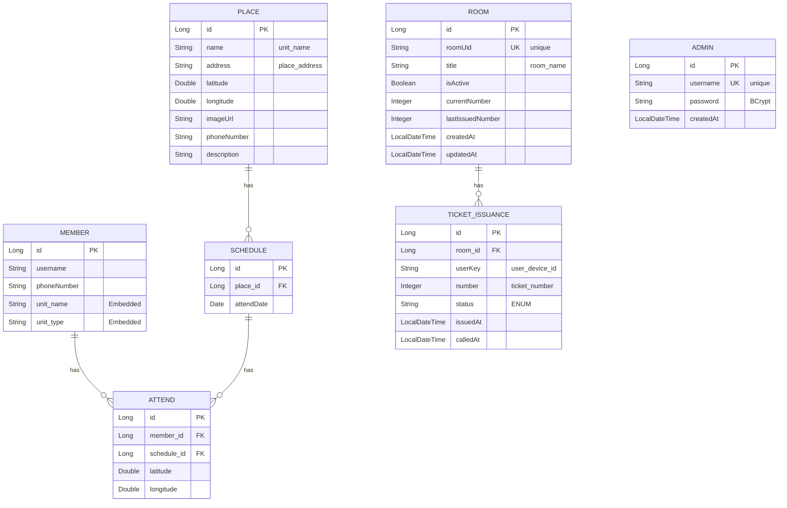
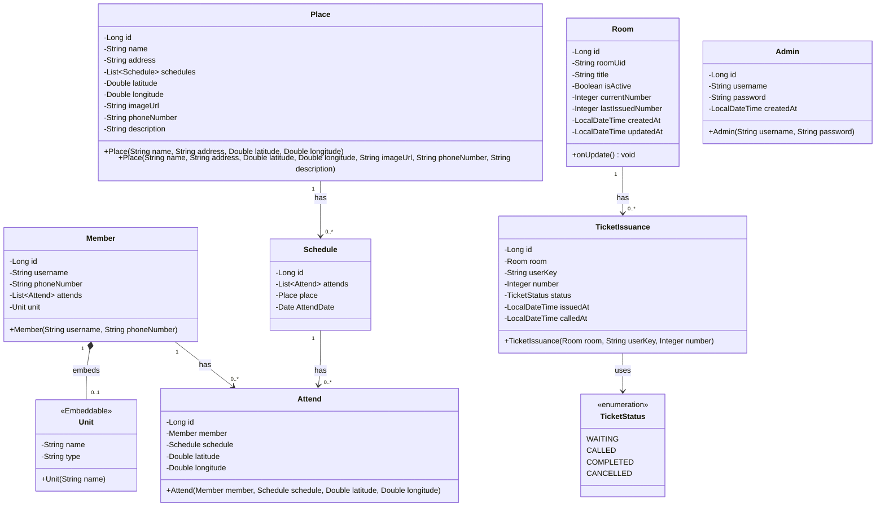
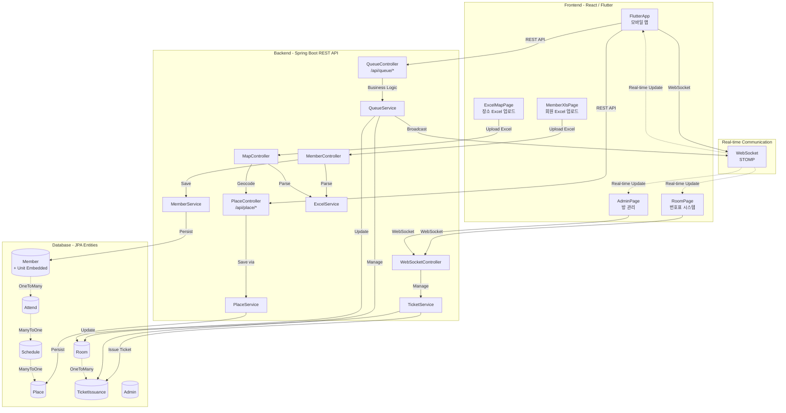
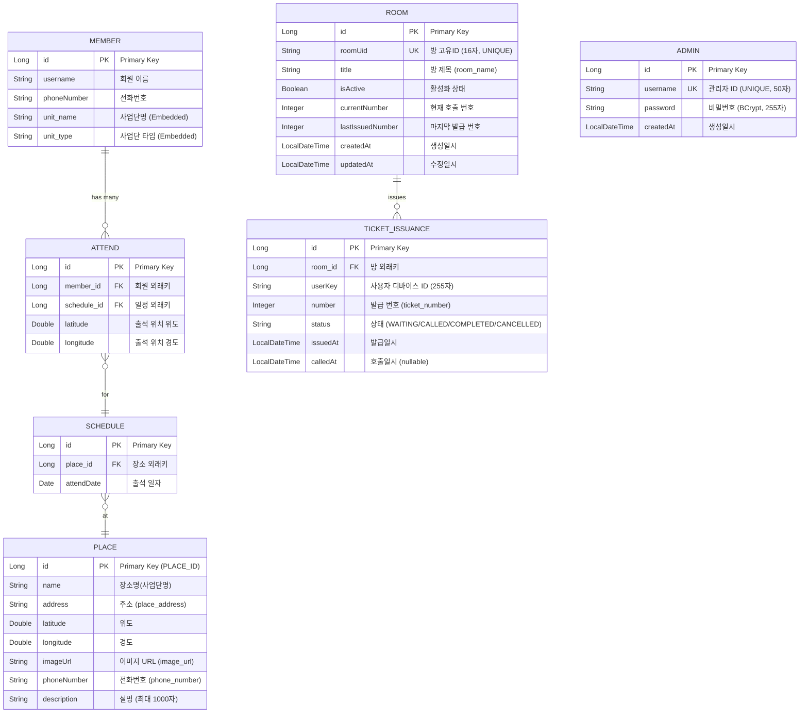
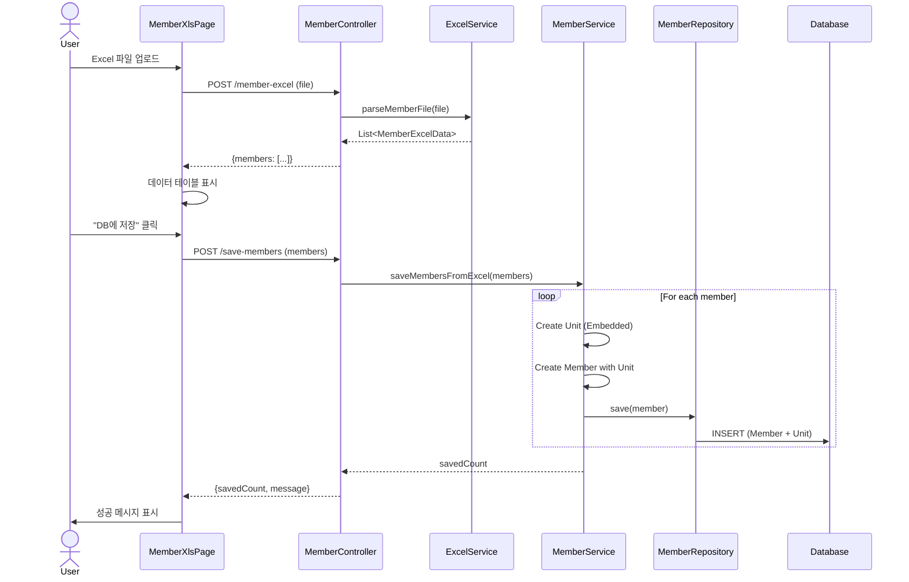
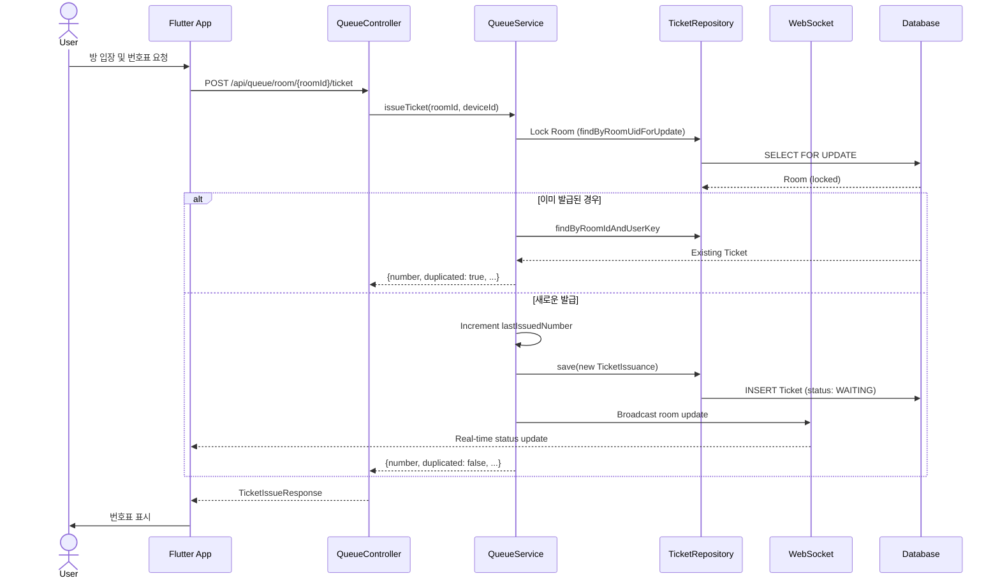
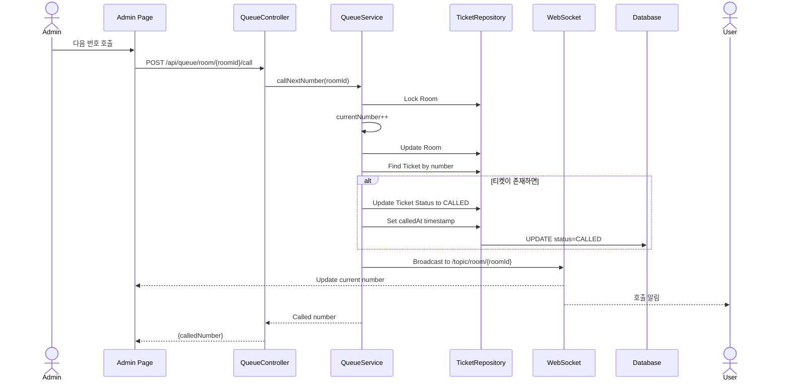
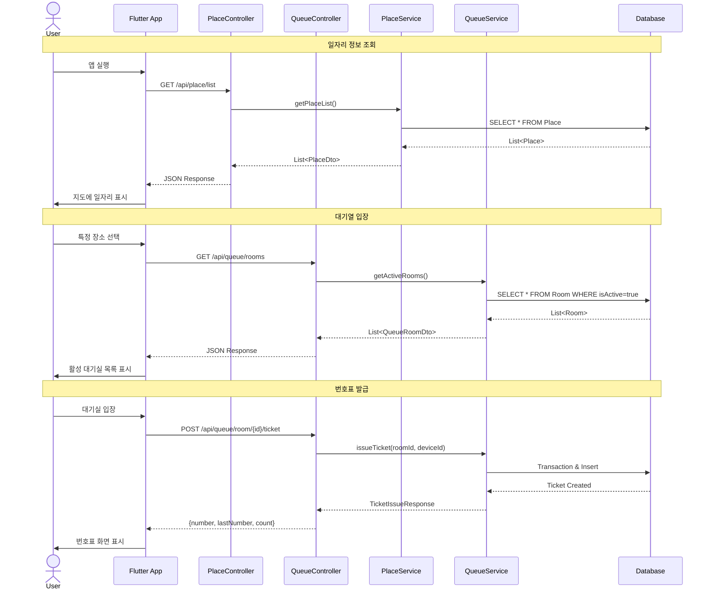

# Database Diagrams

> 마지막 업데이트: 2025-11-17
>
> 본 문서는 프로젝트의 데이터베이스 구조와 엔티티 관계를 시각화합니다.

## 📋 목차

1. [ER Diagram (Entity Relationship Diagram)](#er-diagram-entity-relationship-diagram)
2. [ORM Class Diagram](#orm-class-diagram-객체-관계-다이어그램)
3. [Detailed Entity Relationships](#detailed-entity-relationships-with-cardinality)
4. [Database Constraints](#database-constraints)
5. [System Architecture](#system-architecture-diagram)
6. [Business Logic Flow](#business-logic-flow)

---

## ER Diagram (Entity Relationship Diagram)



---

## ORM Class Diagram (객체 관계 다이어그램)



---

## Detailed Relationships

### 출석 관리 시스템 (Attendance Management)

- **Member ↔ Unit**: Member는 Unit(사업단) 정보를 임베디드 타입으로 포함 (Embedded)
  - Unit은 독립적인 엔티티가 아닌 값 타입 (Value Type)
  - Member 테이블에 `unit_name`, `unit_type` 컬럼으로 저장
  - 데이터 중복 최소화 및 도메인 모델 명확화

- **Member ↔ Attend**: Member는 여러 출석 기록을 가질 수 있음 (OneToMany)
  - 양방향 관계, Attend가 연관관계의 주인
  - LAZY 로딩으로 성능 최적화

- **Schedule ↔ Attend**: Schedule은 여러 출석 기록을 가질 수 있음 (OneToMany)
  - 일정별 출석자 관리
  - 출석 위치 정보 포함 (latitude, longitude)

- **Place ↔ Schedule**: Place는 여러 일정을 가질 수 있음 (OneToMany)
  - 장소별 일정 관리
  - Place에는 상세 정보 포함 (주소, 좌표, 이미지, 전화번호, 설명)

### 번호표 시스템 (Queue Ticket System)

- **Room ↔ TicketIssuance**: Room은 여러 번호표 발급 기록을 가질 수 있음 (OneToMany)
  - 방별 번호표 관리
  - 중복 발급 방지를 위한 UNIQUE 제약조건
  - 티켓 상태 관리 (WAITING, CALLED, COMPLETED, CANCELLED)

- **TicketIssuance Status Flow**:
  ```
  WAITING → CALLED → COMPLETED
            ↓
        CANCELLED (언제든지 가능)
  ```

### 관리자 시스템 (Admin System)

- **Admin**: 독립적인 엔티티
  - 시스템 관리자 계정 관리
  - BCrypt 암호화된 비밀번호 저장
  - username은 UNIQUE 제약조건

---

## Database Constraints

### MEMBER
- **id**: Primary Key, Auto-increment
- **username**: NOT NULL
- **phoneNumber**: 회원 연락처
- **unit_name, unit_type**: Embedded Unit 정보

### ATTEND
- **id**: Primary Key, Auto-increment
- **member_id**: Foreign Key → MEMBER(id)
- **schedule_id**: Foreign Key → SCHEDULE(id)
- **latitude, longitude**: 출석 위치 좌표

### SCHEDULE
- **id**: Primary Key, Auto-increment
- **place_id**: Foreign Key → PLACE(id)
- **AttendDate**: 출석 일자

### PLACE
- **id**: Primary Key (PLACE_ID), Auto-increment
- **name**: 장소명 (unit_name)
- **address**: 주소 (place_address)
- **latitude, longitude**: 장소 좌표
- **imageUrl**: 장소 이미지 URL
- **phoneNumber**: 전화번호 (phone_number)
- **description**: 장소 설명 (최대 1000자)

### ROOM
- **id**: Primary Key, Auto-increment
- **roomUid**: UNIQUE, 길이 16자, NOT NULL - 방 고유 식별자
- **title**: 방 제목 (room_name)
- **isActive**: 활성화 상태, NOT NULL, 기본값 true
- **currentNumber**: 현재 호출 번호, NOT NULL, 기본값 0
- **lastIssuedNumber**: 마지막 발급 번호, NOT NULL, 기본값 0
- **createdAt**: 생성일시, NOT NULL
- **updatedAt**: 수정일시, NOT NULL, @PreUpdate로 자동 갱신

### TICKET_ISSUANCE
- **id**: Primary Key, Auto-increment
- **room_id**: Foreign Key → ROOM(id), NOT NULL
  - **fk_ticket_room**: Foreign Key Constraint
- **userKey**: 사용자 디바이스 ID (user_device_id), 최대 255자
- **number**: 발급 번호 (ticket_number), NOT NULL
- **status**: 티켓 상태 (ENUM), NOT NULL, 기본값 WAITING
  - `WAITING`: 대기 중
  - `CALLED`: 호출됨
  - `COMPLETED`: 완료
  - `CANCELLED`: 취소됨
- **issuedAt**: 발급일시, NOT NULL
- **calledAt**: 호출일시 (nullable)

#### Unique Constraints
- **ux_room_device**: UNIQUE(room_id, user_device_id)
  - 한 방에서 한 사용자는 하나의 번호표만 발급 가능
- **ux_room_number**: UNIQUE(room_id, ticket_number)
  - 한 방에서 같은 번호는 중복 불가

### ADMIN
- **id**: Primary Key, Auto-increment
- **username**: UNIQUE, 최대 50자, NOT NULL
- **password**: BCrypt 암호화, 최대 255자, NOT NULL
- **createdAt**: 생성일시, NOT NULL, updatable=false

---

## System Architecture Diagram



---

## Detailed Entity Relationships with Cardinality



---

## Business Logic Flow

### 회원 Excel 업로드 및 저장 플로우



### 번호표 발급 플로우 (Enhanced)



### 번호표 호출 플로우



### Flutter 앱 API 통신 플로우



---

## 테이블 생성 순서 (DDL)

데이터베이스 초기화 시 테이블 생성 순서:

1. **ADMIN** - 독립 엔티티
2. **MEMBER** (with embedded UNIT)
3. **PLACE** - 독립 엔티티
4. **SCHEDULE** - PLACE 참조
5. **ATTEND** - MEMBER, SCHEDULE 참조
6. **ROOM** - 독립 엔티티
7. **TICKET_ISSUANCE** - ROOM 참조

---

## 인덱스 최적화 권장사항

### 성능 향상을 위한 인덱스

```sql
-- ROOM
CREATE INDEX idx_room_uid ON queue_room(room_uid);
CREATE INDEX idx_room_active ON queue_room(is_active);

-- TICKET_ISSUANCE
CREATE INDEX idx_ticket_room_status ON queue_ticket(room_id, status);
CREATE INDEX idx_ticket_issued_at ON queue_ticket(issued_at);

-- PLACE
CREATE INDEX idx_place_coordinates ON place(latitude, longitude);

-- SCHEDULE
CREATE INDEX idx_schedule_date ON schedule(attend_date);
CREATE INDEX idx_schedule_place ON schedule(place_id);

-- ATTEND
CREATE INDEX idx_attend_member ON attend(member_id);
CREATE INDEX idx_attend_schedule ON attend(schedule_id);
```

---

## 변경 이력

### 2025-11-17
- Admin 엔티티 추가 (관리자 계정 관리)
- Room 엔티티에 `isActive`, `lastIssuedNumber`, `updatedAt` 필드 추가
- TicketIssuance 엔티티에 `status` (enum), `calledAt` 필드 추가
- Place 엔티티에 `imageUrl`, `phoneNumber`, `description` 필드 추가
- REST API 엔드포인트 다이어그램 추가
- Flutter 앱 통신 플로우 추가
- 인덱스 최적화 권장사항 추가

### 초기 버전
- Member, Attend, Schedule, Place, Room, TicketIssuance 엔티티 정의
- 기본 ER 다이어그램 및 관계 정의

---

**문서 관리자**: Development Team
**최종 검토**: 2025-11-17
