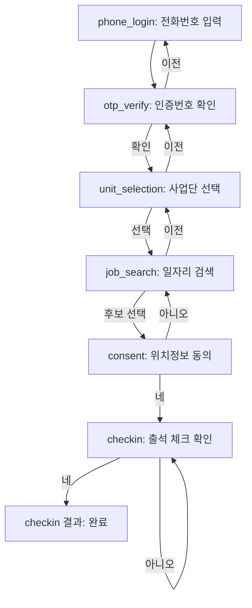

# 어르신 전용 ATM 스타일 앱 화면 재기획 — 설계

## 배경 및 목표

현재 Flutter 앱(`mobile/lib/features/`)에는 `phone_login`, `otp_verify`, `unit_selection`, `job_search`, `consent`, `checkin` 6개 화면이 이미 기능 단위로 구현되어 있다. 다만 UI는 기본 Material 위젯(`TextField`, `ElevatedButton`, `ListTile` 등) 수준이라 화면마다 스타일이 통일되어 있지 않고, 시니어 사용자를 배려한 시각 디자인이 반영되어 있지 않다.

이 문서는 은행 어르신 전용 ATM UI(참고 이미지: 신한은행 ATM 캡처)의 디자인 언어 — 직각형 버튼, 초록/주황 대비, 화면당 한 질문, 큰 글씨 — 를 이 6개 화면에 그대로 적용하기 위한 **시각 디자인 및 화면 레이아웃 기획**이다. 실제 코드 변경, 신규 API, 신규 라우트는 이번 문서의 범위에 포함하지 않는다.

## 참고 자료 요약

참고 ATM 캡처에서 반복되는 3가지 화면 패턴을 확인했다.

1. **홈/메뉴형**: 2x2 직각형 초록 버튼 그리드 + 하단 주황 전체폭 바
2. **질문+목록형**: 좌측(또는 상단) 큰 질문 문장(최대 2줄) + 우측(또는 하단) 세로 목록(아이콘+텍스트, 초록 배경, 최대 3개) + 하단 주황 전체폭 "취소" 바
3. **확인(Yes/No)형**: 상단 질문 + 중간 정보 요약 + 하단을 반씩 나눈 좌측 초록 "네" / 우측 주황 "아니오" 버튼

공통 요소: 모서리 각짐(둥근 모서리 없음), 초록=진행, 주황=취소·이전·아니오, 큰 글씨, 항목 간 얇은 구분선.

## 디자인 시스템

### 색상

| 용도 | 색상 | 사용처 |
|---|---|---|
| Primary (진행) | `#2E9E4F` | 확인, 다음, 네, 목록 항목 배경 |
| Secondary (취소) | `#F5821F` | 취소, 이전, 아니오 |
| 배경 | `#F7F7F7` | 화면 배경 |
| 질문 텍스트 | `#000000` | 화면 최상단 질문 문장 (검정 고정) |

### 타이포그래피

- 질문 문장(화면 최상단): 22~26sp, 굵게, 최대 2줄, 검정
- 버튼 라벨: 18~22sp, 굵게, 흰색
- 보조 안내문구: 14~15sp, 회색
- 별도 폰트 파일 도입 없이 시스템 기본 한글 산세리프를 사용한다.

### 모양 규칙

- 모서리 각짐: border-radius 0~2px
- 버튼/리스트 항목 최소 높이 64~72dp
- 리스트 항목 간 1px 흰색 또는 회색 구분선
- 화면당 질문은 하나만 노출한다.
- 목록은 한 번에 최대 3개로 제한한다.

### 공통 컴포넌트

1. **PrimaryButton** — 그린 배경, 흰 굵은 텍스트. 확인/다음/네/인증받기 등 진행 동작 전용.
2. **SecondaryButton** — 오렌지 배경, 흰 굵은 텍스트. 취소/이전/아니오 전용.
3. **OptionListItem** — 아이콘(좌) + 라벨(우) 가로 카드, 그린 배경, 세로로 최대 3개까지 쌓임.
4. **BottomActionBar** — 화면 하단 전체폭 고정 바. 두 변형:
   - (a) 오렌지 단색 "← 취소 / 이전" 단일 바
   - (b) 좌우 반분할 그린 "○ 네" / 오렌지 "✕ 아니오" 바
5. **NumericKeypad** — 0~9 + 지우기 + 확인/인증받기로 구성된 화면 내 커스텀 숫자 키패드. OS 기본 키보드를 대체한다 (`phone_login`, `otp_verify` 전용).

모든 화면은 반드시 `BottomActionBar` 중 하나를 갖는다 — 시니어 사용자가 화면 유형과 무관하게 항상 같은 위치에서 "뒤로 가는 방법"을 찾을 수 있게 하기 위함이다.

## 화면 흐름



## 화면별 상세 기획

### 1. phone_login

목적: 전화번호 입력 후 OTP 발송 요청.

```
┌─────────────────────────┐
│ 로그인                    │
├─────────────────────────┤
│ 전화번호를                │  ← 질문(검정, 26sp)
│ 입력해주세요               │
│                          │
│ [010 - 1234 - _ _ _ _]  │  ← 입력 표시 박스(그린 테두리)
│                          │
│ [1] [2] [3]              │
│ [4] [5] [6]              │  ← NumericKeypad
│ [7] [8] [9]              │
│ [지우기] [0] [인증받기]     │
├─────────────────────────┤
│         ✕ 취소            │  ← BottomActionBar(단일)
└─────────────────────────┘
```

- OS 키보드 대신 NumericKeypad로 전화번호를 입력한다.
- 입력 표시 박스는 그린 테두리, 입력된 숫자만 큰 글씨로 보여준다.
- 하단 "취소"는 앱 시작 상태로 되돌아간다(첫 화면이므로 "이전" 대상 없음).

### 2. otp_verify

목적: SMS로 받은 인증번호 6자리 확인.

```
┌─────────────────────────┐
│ 인증번호 입력              │
├─────────────────────────┤
│ 문자로 받은 번호            │  ← 질문(검정, 24sp)
│ 6자리를 입력해주세요        │
│                          │
│ [3][2][9][_][_][_]      │  ← 6칸 OTP 표시 박스
│                          │
│ [1] [2] [3]              │
│ [4] [5] [6]              │  ← NumericKeypad
│ [7] [8] [9]              │
│ [지우기] [0] [확인]        │
├─────────────────────────┤
│         ← 이전            │  ← BottomActionBar(단일)
└─────────────────────────┘
```

- OTP 6칸은 채워진 자리는 그린 테두리, 빈 자리는 회색 테두리로 구분한다.
- 하단 "이전"은 phone_login으로 되돌아간다.

### 3. unit_selection

목적: 소속 사업단 선택(최대 3개).

```
┌─────────────────────────┐
│ 사업단 선택                │
├─────────────────────────┤
│ 사업단을 선택해주세요 (22sp, 한 줄) │
│                          │
│ [사업단 A]                │  ← OptionListItem
│ [사업단 B]                │
│ [사업단 C]                │
├─────────────────────────┤
│         ← 이전            │
└─────────────────────────┘
```

- 질문 문장은 22sp, 줄바꿈 없이 한 줄로 고정한다(사용자 피드백 반영 — 26sp/2줄 대신 한 줄에 맞춰 축소).
- 사업단명은 운영 데이터에서 받아오며 문서에 고정 문구로 박아두지 않는다(기존 `senior-job-search-kiosk-planning.md` 4.2절과 동일 원칙).

### 4. job_search

목적: 사업단 내 일자리를 자연어로 검색하고 후보를 확인.

```
┌─────────────────────────┐
│ {사업단명} 일자리 찾기       │
├─────────────────────────┤
│ 어떤 일을 하시나요? (22sp)  │
│ [검색어 입력_____________] │
│                          │
│ 검색 결과 (최대 3개)        │
│ [분리수거 지원]             │  ← OptionListItem
│  행복아파트 · 재활용품 배출 지원│    (일자리명 + 장소/설명)
│ [공원 환경 정리]            │
│  중앙공원 · 청소 및 환경 정리  │
│                          │
│ [AI로 더 찾아보기]          │  ← 결과 0건일 때만 노출
├─────────────────────────┤
│         ← 이전            │
└─────────────────────────┘
```

- **기존 `senior-job-search-kiosk-planning.md` 4.3절의 "하단 자주 쓰는 단어 빠른 선택 버튼"은 이번 재기획에서 제외한다** (사용자 피드백 반영). 화면은 검색어 입력 → 검색 결과만으로 구성한다.
- 후보를 탭하면 별도 확인 화면 없이 바로 `consent` 화면으로 이동한다. 이는 실제 코드(`job_search_screen.dart`의 `_select` → `ConsentScreen` 즉시 이동) 동작과 일치시킨 것이며, 기존 문서 4.4절의 "이 일자리가 맞나요?" 확인 화면은 이번 기획에 포함하지 않는다.

### 5. consent

목적: 위치정보 수집 동의(최초 1회).

```
┌─────────────────────────┐
│ 위치정보 수집 동의          │
├─────────────────────────┤
│ 위치정보 수집에             │  ← 질문(검정, 24sp)
│ 동의하시겠어요?             │
│                          │
│ 출석 체크 시점의 위치(GPS)를  │  ← 요약 설명(15sp, 회색)
│ 수집하며, 출석 확인 목적으로만│
│ 사용됩니다. 최초 1회만 동의  │
│ 하면 됩니다.               │
│                          │
│ 자세히 보기 (밑줄, 그린)     │  ← 전문 약관 링크
├─────────────────────────┤
│  ○ 네    │   ✕ 아니오     │  ← BottomActionBar(분할)
└─────────────────────────┘
```

- 기존 화면의 긴 약관 전문 + 체크박스 방식을, 핵심 요약 1~2문장 + 네/아니오 확인 패턴으로 단순화한다(사용자 피드백 반영).
- 전문 약관은 "자세히 보기"를 눌렀을 때만 별도 스크롤 화면으로 보여준다.

### 6. checkin

목적: 위치 확인 후 출석 체크 확정.

```
[확인 화면]
┌─────────────────────────┐
│ 출석 체크                  │
├─────────────────────────┤
│ 지금 출석 체크를            │  ← 질문(검정, 24sp)
│ 하시겠어요?                │
│                          │
│ 현재 위치         확인됨 ✓  │  ← 정보 요약 박스
│ 시간              09:02   │
├─────────────────────────┤
│  ○ 네    │   ✕ 아니오     │
└─────────────────────────┘

[결과 화면 ("네" 선택 후)]
┌─────────────────────────┐
│           ✓              │
│  출석 체크가               │
│  완료되었습니다             │
├─────────────────────────┤
│          확인             │  ← 단일 그린 바
└─────────────────────────┘
```

- 기존 화면은 버튼 하나 + 결과 텍스트로만 구성되어 있었으나, "확인 질문 + 정보 요약 + 네/아니오" 확인형 패턴으로 재구성한다.
- "아니오"는 체크인을 취소하고 같은 화면에 머문다.
- "네" 선택 후 결과 화면은 성공/실패 메시지를 큰 아이콘과 함께 보여주고, 하단은 단일 "확인" 바로 앱의 대기 상태로 복귀한다.

## 기존 문서와의 관계

`docs/senior-job-search-kiosk-planning.md`는 일자리 검색 **로직**(키워드/동의어 매칭, LLM 폴백, 관리자 데이터 구조, 검색 실패 로그)을 다루는 문서로 계속 유지한다. 이번 문서는 6개 화면 전체의 **시각 디자인과 레이아웃**만 전담하며, 두 문서는 역할이 겹치지 않는다.

다만 시각 레이아웃 결정 과정에서 기존 문서와 어긋나는 부분이 두 곳 있었다(위 4번 화면 참고): 자주 쓰는 단어 빠른 선택 버튼 제외, 결과 확인 화면 생략. 검색 로직 자체(키워드 매칭, LLM 폴백 등)는 영향받지 않는다.

## 범위 및 제외 사항

이번 기획에 포함되는 것:
- 6개 화면(phone_login, otp_verify, unit_selection, job_search, consent, checkin)의 색상/타이포/레이아웃/컴포넌트 기획
- 화면 간 이동(취소/이전/네/아니오) 규칙

이번 기획에서 제외하는 것:
- 실제 Flutter 위젯 코드 작성/수정
- 신규 API, 신규 도메인/스키마 변경
- 아이콘 에셋 실제 제작(플레이스홀더 사각형으로 표기)
- 별도 폰트 파일 도입
- `senior-job-search-kiosk-planning.md`가 다루는 검색 로직/관리자 화면 변경

## 성공 기준

- 6개 화면 모두 동일한 색상 규칙(그린=진행, 오렌지=취소)과 동일한 하단 고정바 위치를 갖는다.
- 화면마다 질문은 하나만 노출되고, 목록은 최대 3개로 제한된다.
- 시니어 사용자가 어떤 화면에 있든 같은 위치(하단)에서 뒤로 가는 방법을 찾을 수 있다.

## 다음 단계

이 문서는 시각 디자인/화면 레이아웃 스펙이며, 실제 Flutter 구현 여부와 시점은 별도로 결정한다.
